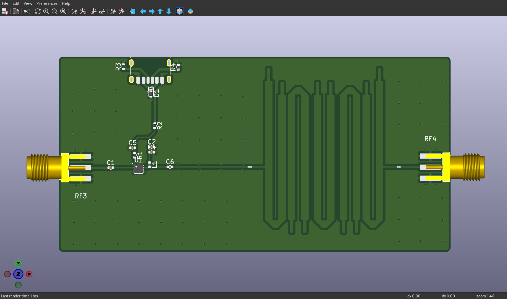
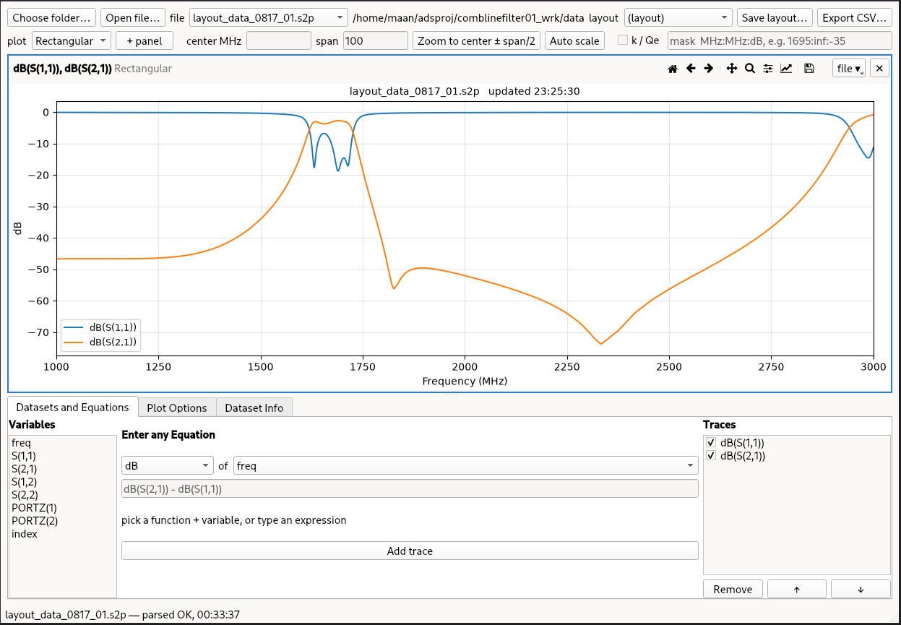
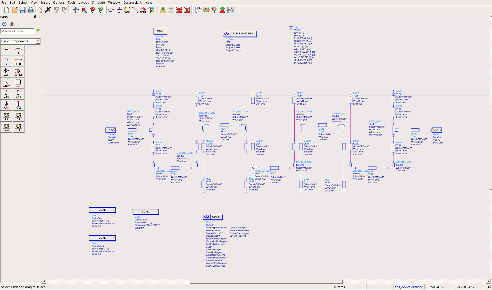
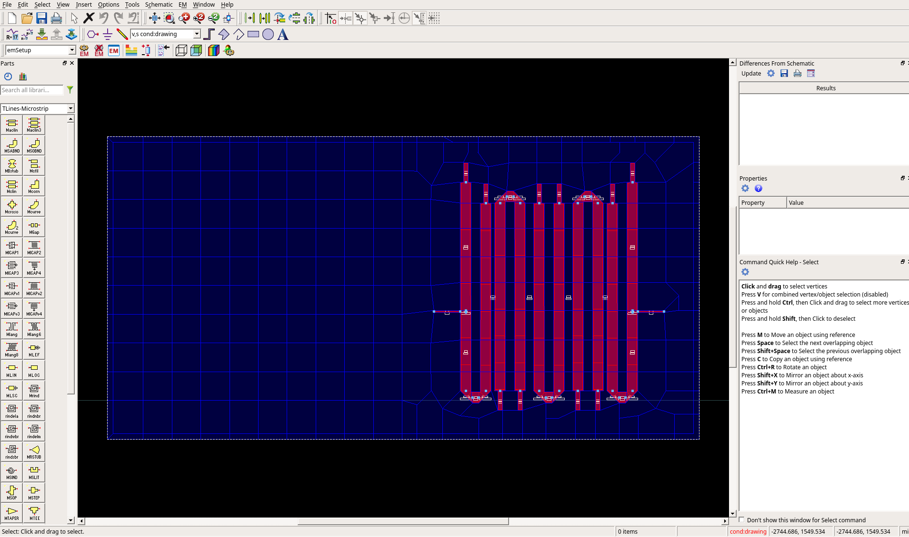

# GOES Receiver

Made a GOES Receiver that operates on 1694.1 MHz, intended to interpret HRIT signals. This is the low noise amplifier and filter portion. 

*PCB Render in KiCAD.*

## BOM:
- QLP9547 Low Noise Amplifier
- RF Coaxial Connectors
- USB-C Port
- Miscellaneous (resistors, inductors, etc)

## Filter Topology:
Designed using ADS, the filter is a 5th order Chebyshev filter based off of a hairpin design, intended to have 80 MHz bandwidth and operate as a bandpass filter. This compacts space and allows for the filter to fit on the PCB (which uses a PTFE Teflon dielectric). However, it does result in some insertion loss as can be seen in the attached graphs plotting S(1,1) and S(2, 1). At 1694.1 MHz, there's around -2.7 dB of insertion loss on S(2,1). Not bad!

*Figure 1: Graph looking at the insertion loss of the filter.*

*Figure 2: Taken from ADS Studio, shows the schematic of the filter based off of microstrip lines.*

*Figure 3: Render of the Chebyshev filter on its own in KiCad.*

## What's left
Currently, software needs to be added and the board needs to be evaluated using a dish to receive the signals. 

## Gratitudes
Worked on with Xuanming Liu. 

